Компиляция PvPGN 1.99 из SVN (Windows)
===

В этом руководстве рассматривается подробная пошаговая компиляция последних исходников сервера PvPGN 1.99 из SVN, под Windows, с помощью Visual Studio 2010. Эта версия PvPGN не является стабильной, но тем не менее рекомендую использовать именно её, т.к. по сравнению с 1.8.5 в ней множество улучшений. 

В конце статьи есть видео, на котором показан весь процесс от начала до конца, на свежеустановленной виртуальной машине с Windows XP. 


> Всё тоже самое, но автоматически, можно сделать с помощью [PvPGN Magic Builder][1]


Подготовка файлов
-----------------

1. Скачать и установить [Visual C++ Express 2010][2]
Если у вас уже установлена полная версия Visual Studio 2010, то экспресс качать не нужно. 
Можно использовать и Visual Studio 2008, отличие будет только в выборе компилятора в [CMake][3]. 

2. Скачать и установить последнюю версию CMake. На момент написания этой статьи последняя версия 2.8.4 ([скачать установку][4]). Более ранние не поддерживают VS 2010. 

3. Скачать [исходники PvPGN из SVN][5] (с помощью [TortoiseSVN][6]), либо скачать их архивом ([на сайте][7], в разделе   "pvpgn (development)" ) 
 > Адрес SVN: svn://svn.berlios.de/pvpgn/trunk/pvpgn

 
 Положить исходники в отдельную папку. В этом примере будет папка `c:\svn\pvpgn\`

 Переименовать файлы конфигов в папке `pvpgn\conf\`, с заменой:
 ```
 bnetd.conf.win32 > bnetd.conf.in 
 d2cs.conf.win32 > d2cs.conf.in 
 d2dbs.conf.win32 > d2dbs.conf.in 
 ```

 Открыть файл `pvpgn\cmake\Modules\DefineInstallationPaths.cmake`, найти строчку `${EXEC_INSTALL_PREFIX}/etc` и изменить  её на `${EXEC_INSTALL_PREFIX}conf`
 
 > Если же оставить как есть, то CMake заменит пути в конфигах на абсолютные, типа `C:\Program files\pvpgn\conf\`, и PvPGN будет искать их только там. А конфиг будет искаться в папке `etc`. Это сделано для UNIX систем и установлено по-умолчанию.

4. Скачать zlib заголовочные файлы [zlib125.zip][8] и библиотеку [zlib125dll.zip][9]

 Извлечь их в папку `c:\svn\pvpgn\zlib`
 ```
 zlib125.zip\zlib-1.2.5\zconf.h > c:\svn\pvpgn\zlib\zconf.h 
 zlib125.zip\zlib-1.2.5\zlib.h > c:\svn\pvpgn\zlib\zlib.h 
 zlib125dll.zip\dll32\zlibwapi.lib > c:\svn\pvpgn\zlib\zlibwapi.lib
 ```
 > Можно скачать в отдельном архиве [zlib125_headers.zip][10] только эти файлы.


5. Скачать заголовочные файлы и библиотеку для базы данных (MySQL, PostgreSQL, SQLite, ODBC). 

 Далее будет показано, как скомпилировать с MySQL, а где скачать эти файлы подробно описано в [этой статье][11]. 
 Их можно положить в `c:\svn\pvpgn\mysql` (см. подробнее ниже).


Процесс
-------
1. Запустить CMake в графическом режиме (cmake-gui) и указать путь к исходникам PvPGN:

 ```
 Where is the source code: C:/svn/pvpgn 
 Where to build the binaries: C:/svn/pvpgn/build
 ```

 Нажать Configure и выбрать Visual Studio 10 в качестве компилируемой среды: 
 
 [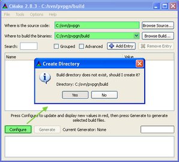](cmake_start.png)
 [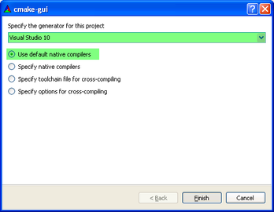](cmake_select_compiler.png)
 

2. После некоторого ожидания CMake должен выделить всё красным - это те переменные, которые были добавлены скриптами cmake из SVN. То есть, это нормально, если в конце написано `Configuring done`. 

 Теперь нужно изменить некоторые флажки:
 ```
 WITH_MYSQL = true (если компилируем с поддержкой MySQL) 
 WITH_WIN32_GUI = false (хоть это и винда, но графический интерфейс будет съедать свою долю ресурсов, поэтому сервер должен быть консольным) 
 ANSI=false (отключить строгую проверку ANSI при использовании MySQL, из-за недопустимых типов "long long") 
 CMAKE_INSTALL_PREFIX = "" (пустое значение, чтобы конфиг открывался не из Program files, а из папки с PvPGN)
 ```

 Нажать ещё раз Configure, но теперь красным выделятся ошибки в путях к заголовочным файлам MySQL, которые надо вручную указать:
 ```
 MYSQL_INCLUDE_DIR = C:/svn/pvpgn/mysql 
 MYSQL_LIBRARY = C:/svn/pvpgn/mysql/libmySQL.lib
 ```

 [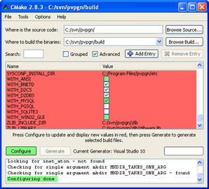](cmake_configure.png)
 [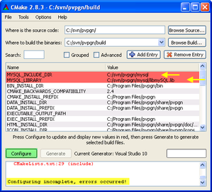](cmake_configure_mysql.png)
 

 > После нажатия `Configure`, некоторые переменные сразу "пропадают" и недоступны для редактирования. Чтобы отобразить весь список переменных, достаточно включить флажок `Advanced`. 

 > CMake кеширует все результаты, поэтому, если что-то пошло не так, во избежание непонятных ошибок, - лучше сразу почистить кеш через `File > Delete cache` и запустить конфигурацию заново. 

 > Пути для MySQL лучше выбирать через кнопочку `...`, в експлорере. В CMake слеши почему-то не виндовые (`\`), а юниксовые (`/`); если поставить виндовые, то при компиляции возникнут ошибки которые потом трудно будет локализовать (например, [такая][12]). 

 > В `.cmake` файлах PvPGN'a устаревший поиск для MySQL, который ищет заголовочные файлы только в `Program files`, и только для версий MySQL <= 5.0. 
 Чтобы это исправить, в файле pvpgn\cmake\Modules\FindMySQL.cmake, в разделе `FIND_PATH(MYSQL_INCLUDE_DIR mysql.h` можно добавить строчку `${CMAKE_SOURCE_DIR}/mysql`, и поиск будет осуществляться так же, как для zlib - в папке с исходниками.


 Затем нажимаем `Generate`, и папке `build` должен появиться солюшен `pvpgn.sln`

 [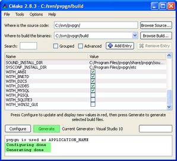](cmake_generate.png)
 [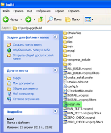](vs_solution_file.png)

3. Открываем `pvpgn.sln` в Visual Studio и сразу переключаем режим компиляции в `Release`. Иначе, в исполняемые файлы запишется Debug код, они будут в несколько раз больше по размерам и чуть медленнее работать. 

 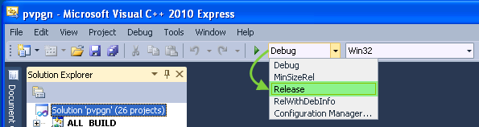

4. Данный шаг необходимо выполнить только для Visual Studio Express. 
 Скачайте [vsexpress_include.zip][13] из которого все файлы надо извлечь в отдельную папку. 
 Теперь для каждого из проектов (`bnetd`, `d2cs`, `d2dbs`) в свойствах необходимо указать путь к этой папке в `Configuration properties > VC++ Directories > Include Directories`. 

 [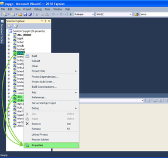](vs_properties.png)
 [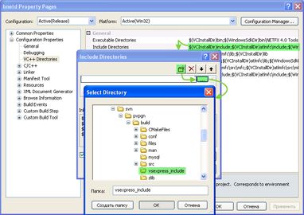](vs_include.png)

 > Эти файлы я взял из Enterprise студии по пути `C:\Program Files\Microsoft Visual Studio 10.0\VC\atlmfc\` 
 > Если в проекте не указать к ним `include path`, то в VSExpress основные проекты (`bnetd`, `d2cs`, `d2dbs`) не скомпилируются из-за ошибки:
 ```
 ..\..\..\src\win32\resource.rc(12): fatal error RC1015: cannot open include file `afxres.h`.
 ```

 > В более ранних версиях Visual Studio `VC++ Directories` находится в настройках самой студии `Tools > Options > Project and Solutions`


5. Нажимаем правой кнопкой на проект `ALL_BUILD` и в меню выбираем `Rebuild` (это то же самое, что `Clean` + `Build`). Или можно выбрать отдельные проекты, если требуется скомпилировать их выборочно. 

 [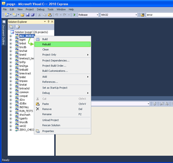](vs_rebuild.png)
 [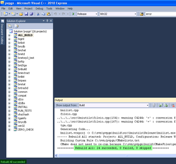](vs_build_success.png)

6. Если все сделано в точности по данному туториалу, каждый проект должен скомпилироваться в отдельную папку. В моем случае, все появится в папке `C:\svn\pvpgn\build\src\`
 > Например, исполняемый файл PvPGN расположится в папке `C:\svn\pvpgn\build\src\bnetd\Release\bnetd.exe`

 Для запуска `bnetd.exe` необходимы 2 DLL файла:
 ```
 zlibwapi.dll (из zlib123dll.zip) 
 libmysql.dll (клиентская библиотека mysql) 
 ```

На этом все! Желаю успешной компиляции :) 

[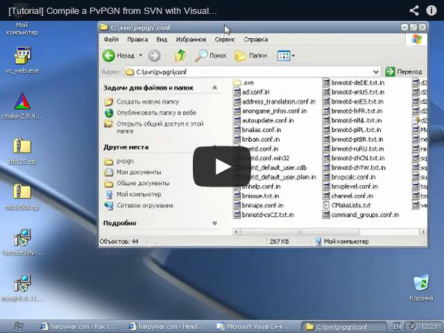](http://www.youtube.com/watch?feature=player_embedded&v=w2bx3rMf85M)


[1]: http://code.google.com/p/pvpgn-magic-builder
[2]: http://www.microsoft.com/visualstudio/ru-ru/products/2010-editions/visual-cpp-express
[3]: http://www.cmake.org/cmake/resources/software.html
[4]: http://www.cmake.org/files/v2.8/cmake-2.8.4-win32-x86.exe
[5]: http://developer.berlios.de/svn/?group_id=2291
[6]: http://tortoisesvn.net/downloads.html
[7]: http://developer.berlios.de/project/showfiles.php?group_id=2291
[8]: http://www.winimage.com/zLibDll/zlib125.zip
[9]: http://www.winimage.com/zLibDll/zlib125dll.zip
[10]: http://harpywar.com/files/items/pvpgn/zlib125_headers.zip
[11]: http://harpywar.com/?a=articles&b=2&c=1&d=70
[12]: http://forums.pvpgn.org/index.php?topic=103.msg16587#msg16587
[13]: http://harpywar.com/files/items/pvpgn/vsexpress_include.zip


